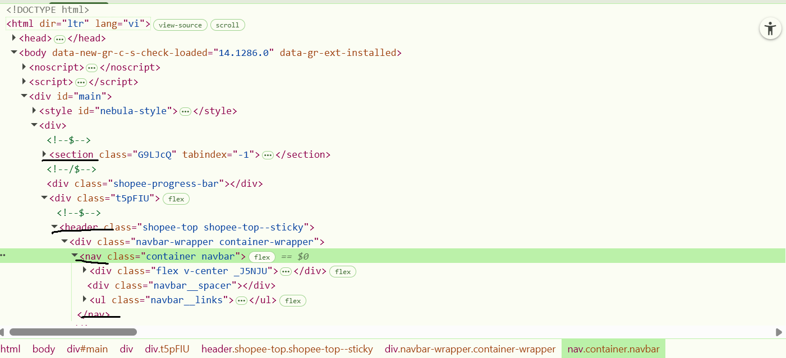
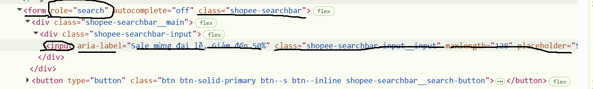

BÀI LÀM
Câu A1 (5đ) — HTTP & Browser
CÂU A1: 
- Nguồn tham chiếu : tuan_1_html5/01_introduction_html_universe.md
                    -> 1. WEB HOẠT ĐỘNG NHƯ THẾ NÀO?
- Trả lời: 
    + Ý 1:
            1. DNS lookup
            2. Thiết lập kết nối "Bắt tay" giữa trình duyệt và server [(TCP 3-way Handshake) nhằm thiết lập kết nối tin cậy + (TLS Handshake) sau TCP phải thương lượng mã hóa do Shopee dùng HTTPS]
            3. Trình duyệt gửi HTTP request -> server
            4. Server xử lí request
            5. Server phản hồi HTTP response -> server kèm header + body
            6. Parse + Render
    + Ý 2:  
CÂU A2:
- Nguồn tham chiếu : tuan_1_html5/04_visible_part_html.md ->  Semantic HTML5 — "Thẻ có ý nghĩa"
- Trả lời: 
    + 5 lỗi semantic:
        Lỗi 1 — 
 thay vì <header>: Google không biết đây là phần đầu trang, không nhận ra logo và menu thuộc về header.
        Lỗi 2 — 
 thay vì <nav>: Đây là lỗi nặng nhất về SEO. <nav> báo cho Google biết đây là điều hướng chính của site — ảnh hưởng trực tiếp đến việc crawl và index.
        Lỗi 3 — 
 thay vì <article>: Sản phẩm là nội dung độc lập, cần <article>. Thiếu <main> bao ngoài khiến Google không xác định được vùng nội dung chính.
        Lỗi 4 —  thiếu alt: Không có alt text = Google Images không index được ảnh, mất một kênh SEO. Ngoài ra thiếu <figure> + <figcaption> nên không có giá trị ngữ nghĩa cho ảnh sản phẩm.
        Lỗi 5 — 
 thay vì <h1>: Tiêu đề sản phẩm phải là heading tag để Google hiểu độ quan trọng. 
 không mang trọng số SEO gì cả.
    + Sửa lại:
        <header>
            
ShopTLU

            <nav>
                <a href="/">Trang chủ</a>
                <a href="/products">Sản phẩm</a>
            </nav>
        </header>

        <main>
            <article>
                <h1>iPhone 16 Pro</h1>
                
25.990.000đ

                <figure>
                    
                    <figcaption>iPhone 16 Pro - 25.990.000đ</figcaption>
                </figure>
            </article>
        </main>

        <footer>© 2026 ShopTLU</footer>
CÂU A3 (5đ) — Block vs Inline:
- Nguồn tham chiếu : tuan_1_html5/04_visible_part_html.md -> Block vs Inline — Hai loại element cơ bản
- Trả lời: Vẽ bằng text
┌─────────────────────────────────┐
│ Hộp 1                           │
└─────────────────────────────────┘
Text A  Text B
┌─────────────────────────────────┐
│ Hộp 2                           │
└─────────────────────────────────┘
Text C  **Text D**
┌─────────────────────────────────┐
│ Hộp 3                           │
└─────────────────────────────────┘
CÂU A4 (5đ) — Table:
- Nguồn tham chiếu : tuan_1_html5/05_tables_hyperlinks.md -> Table — Bảng dữ liệu
- Trả lời: 
    + <thead>, <tbody>, <tfoot> là gì?
        <thead>: Đầu bảng, Chứa<th>(tiêu đề)
        <tbody>: Giữa bảng, Chứa <td> (dữ liệu)
        <tfoot>: Cuối bảng, Chứa<td> (tổng kết)
        ->Cả 3 đều không bắt buộc
    + Tại sao KHÔNG NÊN dùng <table> để tạo layout?
        1. Lý do 1 — Sai ngữ nghĩa, hại SEO
            <table> sinh ra để chứa dữ liệu dạng bảng, không phải để chia layout. Khi Google bot đọc <table> nó kỳ vọng thấy dữ liệu có cấu trúc hàng/cột. Dùng table để chia 3 cột layout = đánh lừa Google = SEO bị trừ điểm.
        2. Lý do 2 — Responsive cực kỳ khó
            CSS Flexbox và Grid co giãn tự nhiên theo màn hình. Table thì không — mỗi cột bị ràng buộc bởi nội dung bên trong, rất khó làm mobile-friendly mà không hack CSS phức tạp
        3. Lý do 3 — Accessibility bị phá vỡ
            Screen reader (phần mềm đọc màn hình cho người khiếm thị) đọc <table> theo logic hàng × cột dữ liệu. Khi dùng table làm layout, nó đọc nhảy lung tung — sidebar đọc xen vào giữa bài viết, footer đọc trước header.
        4. Lý do 4 — Code rối, khó maintain
PHẦN B — THỰC HÀNH CODE (60 điểm)
Bài B1 (15đ) — Trang Profile cá nhân
- Trả lời: 
Bài B2 (15đ) — Trang Sản phẩm E-Commerce
- Trả lời: 
Bài B3 (15đ) — Debug HTML
- Trả lời: 
    - Liệt kê 10 lỗi: 
    1. Lỗi 1: Dòng 1 — Thẻ <!DOCTYPE> thiếu từ khóa html — Cách sửa: Sửa thành <!DOCTYPE html>.

    2. Lỗi 2: Dòng 5 — Thẻ <title> chưa có thẻ đóng </title> — Cách sửa: Thêm </title> sau nội dung tiêu đề.

    3. Lỗi 3: Dòng 4 — Thuộc tính charset viết sai định dạng — Cách sửa: Sửa utf8 thành UTF-8.

    4. Lỗi 4: Dòng 9 — Thẻ <h1> đóng sai cú pháp (thiếu dấu /) — Cách sửa: Sửa <h1> ở cuối thành </h1>.

    5. Lỗi 5: Dòng 11-12 — Thẻ <a> đóng sai cú pháp (thiếu dấu /) — Cách sửa: Sửa <a> ở cuối thành </a>.

    6. Lỗi 6: Dòng 19 — Giá trị thuộc tính src của thẻ  thiếu dấu ngoặc kép — Cách sửa: Sửa thành src="iphone.jpg".

    7. Lỗi 7: Dòng 19 — Thẻ  thiếu thuộc tính alt (lỗi semantic/Accessibility) — Cách sửa: Thêm alt="iPhone 16 Pro".

    8. Lỗi 8: Dòng 21 — Lỗi lồng thẻ (Overlap): Thẻ <b> mở sau 
 nhưng lại đóng sau 
 — Cách sửa: Đóng thẻ </b> trước khi đóng 
.

    9. Lỗi 9: Dòng 29-31 — Sử dụng thẻ <td> cho tiêu đề bảng thay vì <th> (lỗi semantic) — Cách sửa: Thay <td> bằng <th>.

    10. Lỗi 10: Dòng 16 — Sử dụng hai thẻ <main> trong một trang (mỗi file HTML chỉ được phép có duy nhất một thẻ <main>) — Cách sửa: Chuyển thẻ <main> thứ hai thành thẻ <aside> vì nội dung là Sidebar.

    11. Lỗi 11: Dòng 42 — Thẻ 
 trong footer chưa được đóng — Cách sửa: Thêm thẻ 
 sau nội dung Copyright.
Bài B4 (15đ) — Phân tích trang web thật:
Trả lời: Chọn trang shoppe.vn
1. 
2. Do không có table nên không có chỉ ra được ạ!
3. 
    - Form không có action, xử lí bằng js, react bên dưới
    - Form dùng method mặc định là get để lấy keyword 
    - Input có type mặc định là text
PHẦN C — SUY LUẬN (20 điểm)
Câu C1 (10đ) — Thiết kế cấu trúc

    