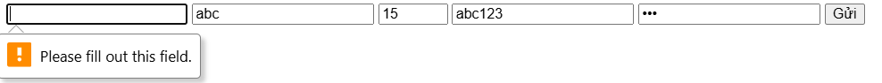
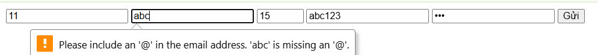
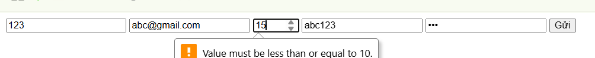
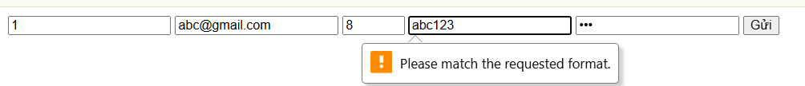
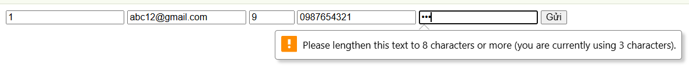

PHIẾU BÀI TẬP 02
HTML5 FORMS & MEDIA — Biểu mẫu, Validation & Đa phương tiện
PHẦN A — KIỂM TRA ĐỌC HIỂU (25 điểm)
Câu A1 (5đ) — Input Types
Trả lời: 
- Nguồn tham chiếu: # nguồn tham chiếu: phần Form cơ bản — Anatomy / 07_forms_interactive.md
1. type="text" → Ô nhập liệu một dòng, chấp nhận mọi ký tự → Dùng cho nhập Tên sản phẩm hoặc Họ tên khách hàng.
2. type="email" → Ô nhập text, tự động kiểm tra định dạng phải có @ và tên miền → Dùng cho Form đăng nhập/đăng ký.
3. type="password" → Ô nhập ẩn ký tự (hiển thị dấu chấm/sao) → Dùng cho Ô nhập mật khẩu hoặc Mã bảo mật thanh toán.
4. type="number" → Ô chỉ cho phép nhập số, có nút tăng giảm, tự kiểm tra min/max → Dùng cho Chọn số lượng sản phẩm trong giỏ hàng.
5. type="tel" → Ô nhập text tối ưu bàn phím số trên di động, hỗ trợ thuộc tính pattern → Dùng cho nhập Số điện thoại nhận hàng.
6. type="date" → Hiển thị bảng chọn lịch (Date Picker), tự kiểm tra ngày hợp lệ → Dùng cho Chọn ngày dự kiến nhận hàng hoặc Ngày sinh thành viên.
7. type="range" → Thanh trượt chọn giá trị trong khoảng xác định thông qua min và max → Dùng cho Bộ lọc khoảng giá (Price Filter).
8. type="file" → Nút mở trình quản lý tệp tin, tự kiểm tra loại tệp bằng accept → Dùng cho Tải ảnh đánh giá sản phẩm hoặc gửi ảnh bảo hành.
9. type="checkbox" → Ô vuông tích chọn, cho phép chọn nhiều giá trị cùng lúc → Dùng cho Bộ lọc thuộc tính (Size L, XL, Màu Đen, Trắng).
10. type="color" → Ô hiển thị bảng màu (Color Picker) để chọn mã Hex → Dùng cho Chọn màu sắc tùy chỉnh cho các sản phẩm đặt làm riêng (ví dụ: in áo, khắc chữ).
Câu A2 (5đ) — Validation Attributes
- Nguồn tham chiếu: phần Các input types HTML5 file 07_forms_interactive.md
Trả lời
Dự đoán: 
- Trường hợp 1 thì form sẽ không submit được và web báo lỗi.
 Vì thuộc tính required kiểm tra rỗng , nếu không có gì thì validation thất bại
- Trường hợp 2:  Form không submit được. Trình duyệt báo lỗi 
Vì với type="email", trình duyệt kiểm tra định dạng email hợp lệ(thiếu @)
- Trường hợp 3:  Trình duyệt báo lỗi vì giá trị vượt quá max=10.
Với type="number", trình duyệt kiểm tra giá trị nằm trong khoảng min–max. 15 > 10 nên invalid.
- Trường hợp 4: Form không submit được. Trình duyệt báo lỗi vì không khớp pattern.
Giải thích: Pattern yêu cầu đúng 10 chữ số ([0-9]{10}). “abc123” chứa chữ cái và chỉ có 3 số, không hợp lệ.
- Trường hợp 5: Form không submit được. Trình duyệt báo lỗi vì độ dài < 8 ký tự.
Giải thích: Thuộc tính minlength yêu cầu ít nhất 8 ký tự, nhưng “123” chỉ có 3 ký tự.
# Kết quả dự đoán, tiên liệu như thần hẹ hẹ hẹ
# Ảnh dự đoán 
# Ảnh dự đoán 
# Ảnh dự đoán 
# Ảnh dự đoán 
# Ảnh dự đoán 
Câu A3 (5đ) — Accessibility:
# tham khảo phần Accesibility file 07_forms_interactive.md
1. Screen reader đọc nội dung của thẻ <label> và liên kết nó với input có id="email". Nhờ vậy, người khiếm thị sẽ nghe được “Email” trước khi nhập dữ liệu, thay vì chỉ nghe “edit box” chung chung. Điều này giúp họ hiểu rõ mục đích của ô nhập, tăng khả năng tiếp cận và giảm nhầm lẫn.
2. Dùng khi có nhóm các input liên quan cùng một chủ đề. <fieldset> tạo khung nhóm, <legend> mô tả nội dung của nhóm.
3. Aria-label dùng để cung cấp mô tả cho thành phần không có văn bản hiển thị rõ ràng (ví dụ: icon button chỉ có hình ảnh, không có text). Nếu đã có <label> thì không nên dùng aria-label vì:
<label> là cách chuẩn, được hỗ trợ tốt nhất cho cả SEO lẫn accessibility.
Dùng cả hai có thể gây xung đột hoặc khiến screen reader đọc trùng lặp.
Câu A4 (5đ) — Media

Trả lời: 
1. Đây là kỹ thuật "lười biếng" có chủ đích. Thay vì tải tất cả hình ảnh ngay khi trang web vừa mở, trình duyệt sẽ trì hoãn việc tải các ảnh nằm ngoài màn hình (viewport). Chỉ khi người dùng cuộn trang đến gần vị trí của ảnh, nó mới bắt đầu được tải về. Giảm thời gian tải trang ban đầu, tiết kiệm băng thông, tăng hiệu suất cho trang có nhiều ảnh (ví dụ trang sản phẩm).
Khi KHÔNG nên dùng: với ảnh quan trọng hiển thị ngay khi mở trang (logo, banner chính, ảnh hero), vì nếu lazy load thì người dùng sẽ thấy trễ hoặc trống. Hoặc với các ảnh quá nhỏ hoặc icon, vì dùng lazy loading còn tốn tgian hơn xử lí bằng tải trực tiếp vì dung lượng của ảnh thấp.
2. Trình duyệt khác nhau hỗ trợ định dạng video khác nhau.
Cung cấp nhiều <source> giúp đảm bảo video chạy được trên hầu hết trình duyệt.
-3 format phổ biến: MP4 (H.264), WebM, Ogg/Theora.
3. Ý nghĩa: cung cấp văn bản thay thế cho ảnh, giúp screen reader đọc cho người khiếm thị, đồng thời hiển thị khi ảnh không tải được.
Viết alt tốt cho 3 trường hợp:
- Ảnh sản phẩm iPhone 16 → alt="iPhone 16 màu đen, mặt trước và sau"
- Ảnh trang trí (decorative) → alt="" (để screen reader bỏ qua, tránh gây nhiễu)
- Ảnh biểu đồ doanh thu Q1/2026 → alt="Biểu đồ cột doanh thu quý 1 năm 2026, doanh thu tăng 20% so với quý trước".
Câu A5 (5đ) — So sánh <figure> vs 
Trả lời:
1. Cách 1 phù hợp cho ảnh đơn giản, chỉ cần alt để hỗ trợ accessibility.
Ví dụ thực tế:Ảnh logo thương hiệu ở góc trang web → alt="Logo Apple"
2. Cách 2 phù hợp cho ảnh cần thêm ngữ cảnh hoặc thông tin chi tiết, giúp người dùng (và cả screen reader) hiểu rõ hơn nội dung ảnh.
Ví dụ thực tế:Trang sản phẩm E-Commerce: ảnh iPhone kèm chú thích giá bán → figcaption="iPhone 16 Pro Max — 25.990.000đ"
PHẦN C — PHÂN TÍCH & SUY LUẬN (20 điểm)
Câu C1 (10đ) — Debug Form
Trả lời:
Lỗi 1: Dòng 2 — Input "Tên" không có thẻ <label>, vi phạm accessibility.
Sửa: <label for="fullname">Tên:</label> <input type="text" id="fullname" name="fullname" required>
Lỗi 2: Dòng 4 — Input "Email" dùng placeholder thay thế nhãn, trình đọc màn hình sẽ không nhận diện được mục đích ô này.
Sửa: <label for="email">Email:</label> <input type="email" id="email" name="email" placeholder="Email của bạn" required>
Lỗi 3: Dòng 6 & 7 — Hai ô "Mật khẩu" không có thuộc tính name, dữ liệu sẽ không được gửi lên server khi submit form.
Sửa: <input type="password" id="pwd" name="password" required> ... <input type="password" id="re-pwd" name="re_password" required>
Lỗi 4: Dòng 9 — Input "Phone" dùng type="text", không tối ưu bàn phím số trên di động và thiếu nhãn đúng cách, thiếu cả pattern,..
Sửa: <label for="phone">Phone:</label> <input type="tel" id="phone" name="phone" value="0901234567">
Lỗi 5: Dòng 11 — Thẻ <select> thiếu thuộc tính name và nhãn mô tả, người dùng không biết chọn tỉnh thành để làm gì.
Sửa: <label for="city">Tỉnh/Thành phố:</label> <select id="city" name="city">...</select>
Lỗi 6: Dòng 12 & 13 — Các <option> thiếu thuộc tính value, server sẽ nhận giá trị text thô, khó xử lý dữ liệu.
Sửa: <option value="hanoi">Hà Nội</option> <option value="hcm">TP.HCM</option>
Lỗi 7: Dòng 16 — Thẻ <label> cho điều khoản thiếu thẻ <input type="checkbox"> bên trong hoặc liên kết for, khiến người dùng không thể tích chọn.
Sửa: <input type="checkbox" id="tos" name="tos" required> <label for="tos">Tôi đồng ý điều khoản</label>
Lỗi 8: Dòng 1 — Thẻ <form> thiếu thuộc tính action và method, trình duyệt sẽ không biết gửi dữ liệu đi đâu và gửi bằng cách nào (GET/POST).
Sửa: <form action="/register" method="POST"> //ví dụ là trang đăng kí
Lỗi 9: Dòng 19 — Nút submit không có aria-label để hỗ trợ accessibility 
Sửa: <input type="submit" value="Gửi" aria-label="Gửi form đặt hàng">
Code sau sửa:
<form action="/submit-form" method="POST">
    

        <label for="fullname">Tên:</label>
        <input type="text" id="fullname" name="fullname" required>
    

    

        <label for="email">Email:</label>
        <input type="email" id="email" name="email" placeholder="Email của bạn" required>
    

    

        <label for="pwd">Mật khẩu:</label>
        <input type="password" id="pwd" name="password" required>
    

    

        <label for="re-pwd">Nhập lại mật khẩu:</label>
        <input type="password" id="re-pwd" name="re_password" required>
    

    

        <label for="phone">Phone:</label>
        <input type="tel" id="phone" name="phone" value="0901234567">
    

    

        <label for="city">Tỉnh/Thành phố:</label>
        <select id="city" name="city">
            <option value="hanoi">Hà Nội</option>
            <option value="hcm">TP.HCM</option>
        </select>
    

    

        <input type="checkbox" id="tos" name="tos" required>
        <label for="tos">Tôi đồng ý điều khoản</label>
    

    <input type="submit" value="Gửi" aria-label="Gửi form đặt hàng">
</form>
Câu C2 (10đ) — Thiết kế chiến lược Validation
Trả lời:
Form mẫu:
<form action="/api/register-bank" method="POST">
    <!-- Email -->
    <label>Email:</label>
    <input type="email" name="email" required>
    <!-- CMND/CCCD -->
    <label>Số CCCD (12 số):</label>
    <input type="text" name="cccd" pattern="\d{12}" title="Vui lòng nhập đúng 12 chữ số" required>
    <!-- Số tài khoản -->
    <label>Số tài khoản (10-15 số):</label>
    <input type="text" name="account_number" pattern="\d{10,15}" title="Số tài khoản từ 10-15 chữ số" required>
    <!-- Mã PIN -->
    <label>Mã PIN (6 số):</label>
    <input type="password" name="pin" pattern="\d{6}" maxlength="6" inputmode="numeric" required>
    <button type="submit">Đăng ký</button>
</form>
Giải thích: HTML5 validation đủ an toàn cho ứng dụng ngân hàng chưa? Tại sao?
Trả lời: HTML5 validation hoàn toàn không đủ an toàn cho các ứng dụng ngân hàng vì 3 lý do sau:
- Dễ bị vô hiệu hóa: Ta có thể mở F12 và xóa hoặc chỉnh thuộc tính như required hoặc pattern của input
- Vượt qua bằng công cụ: Kẻ xấu có thể gửi dữ liệu trực tiếp đến Server thông qua các công cụ như Postman, cURL mà không cần đi qua form HTML, khiến mọi bước kiểm tra trên trình duyệt trở nên vô nghĩa.
- Mục đích thực sự: HTML5 validation chỉ nhằm mục đích nâng cao trải nghiệm người dùng (UX), giúp họ phát hiện lỗi nhập liệu ngay lập tức mà không cần chờ Server phản hồi.
3 loại Validation HTML5 KHÔNG THỂ làm được (Phải dùng JavaScript)
Trả lời: 
- Kiểm tra tính duy nhất (Unique Check): HTML5 không thể kiểm tra xem "Số tài khoản này đã tồn tại trong hệ thống chưa". Việc này cần gọi API (AJAX/Fetch) để kiểm tra trong cơ sở dữ liệu.
- Logic phụ thuộc (Dependent Validation): Ví dụ: Nếu người dùng chọn "Phương thức nhận mã là Email" thì ô "Email" trở thành bắt buộc, nếu chọn "SMS" thì ô "Số điện thoại" mới bắt buộc. HTML5 không xử lý được logic "nếu-thì" này. (if-else)
- Xác nhận khớp dữ liệu (Match Confirmation): HTML5 không có cơ chế mặc định để kiểm tra xem giá trị ô "Mật khẩu" có trùng khớp hoàn toàn với ô "Nhập lại mật khẩu" hay không.
2 rủi ro bảo mật nếu chỉ validate trên Frontend
Trả lời:
- Tấn công SQL Injection hoặc XSS: Kẻ tấn công có thể xóa bỏ validation ở Frontend để gửi các đoạn mã độc (script) hoặc các câu lệnh truy vấn SQL vào form. Nếu Backend không lọc lại, dữ liệu này sẽ thực thi và có thể làm lộ thông tin khách hàng hoặc phá hủy cơ sở dữ liệu.
- Dữ liệu rác và sai lệch hệ thống: Người dùng có thể vô tình hoặc hữu ý gửi các giá trị âm (ví dụ số tiền chuyển khoản là -1.000.000) hoặc định dạng sai lệch. Điều này dẫn đến sai sót trong tính toán số dư, gây thiệt hại tài chính nghiêm trọng cho ngân hàng.

Video: link youtube: https://youtu.be/F425g_D-CQc

